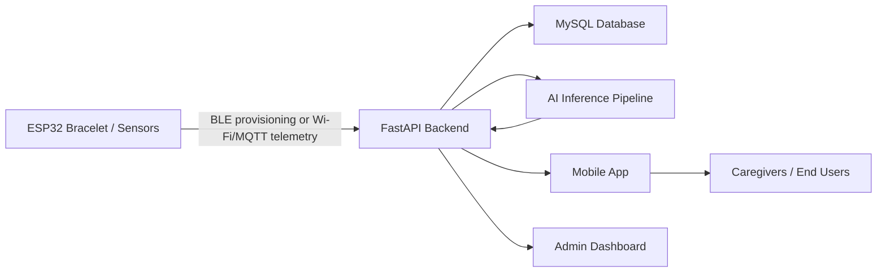

# AI-Based Fall Detection System

[](https://www.python.org/)
[](https://fastapi.tiangolo.com/)
[](https://www.tensorflow.org/)
[](https://expo.dev/)
[](https://www.espressif.com/)

An end-to-end smart fall detection and remote care platform that combines wearable sensing, AI inference, a FastAPI backend, a React Native mobile app, an admin dashboard, and ESP32 firmware for real-world monitoring, emergency response, and caregiver follow-up.

## Overview

This project was built as a full graduation project for continuous health and safety monitoring. The system focuses on two related problems:

1. Detecting an immediate fall event from motion data.
2. Predicting early fall risk before a critical event happens.

The platform is designed around a wearable device and a connected mobile experience. Motion and vital-related telemetry can be collected from an ESP32-based bracelet, sent to the backend for storage and AI processing, and then surfaced to users, caregivers, and administrators through dedicated interfaces.

## What the System Includes

### AI and Prediction

- Multiple deep learning models for fall detection, including LSTM, BiGRU, and hybrid architectures.
- Sliding-window preprocessing for sequential sensor data.
- Dual prediction targets:
  - `fall_now`: immediate fall detection
  - `fall_soon`: early warning / near-future risk
- Ensemble-style inference and verification logic in the backend pipeline.

### Backend

- FastAPI REST API under `/api/v1`
- Health endpoint at `/health`
- Authentication and user management
- Motion, vitals, predictions, alerts, emergency contacts, devices, care links, and admin endpoints
- MQTT listener / streaming integration
- MySQL persistence through SQLAlchemy

### Mobile App

- React Native + Expo application
- Authentication and profile management
- Home dashboard for device state and vitals
- Alerts screen with summaries and filtering
- Emergency contacts management
- Care management workflow for linking caregivers and monitored users
- BLE-based device provisioning and reconnection
- Device removal and re-linking flows
- Arabic and English localization

### Hardware

- ESP32 firmware for wearable data flow
- BLE provisioning for Wi-Fi and backend/MQTT configuration
- Backup BLE telemetry mode when Wi-Fi is lost
- Local persistence of device configuration using `Preferences`
- Structured status reporting back to the mobile app

### Admin Dashboard

- Next.js dashboard for system-level visibility
- User, device, overview, and monitoring views

## System Architecture



## Main Product Flows

### 1. Device Provisioning

1. The mobile app scans for the bracelet over BLE.
2. The app sends provisioning data such as Wi-Fi credentials, user ID, device ID, and MQTT config.
3. The firmware validates and temporarily stores the payload.
4. The device tests Wi-Fi connectivity before saving the new configuration.
5. The bracelet reports provisioning status back to the app using structured BLE JSON messages.

### 2. Monitoring and Prediction

1. Motion data is collected from the wearable.
2. The backend preprocesses the data using sliding windows and scaling.
3. AI models estimate `fall_now` and `fall_soon`.
4. Predictions, alerts, and verification results are stored.
5. The mobile app and dashboard display alerts and monitoring summaries.

### 3. Caregiver Workflow

1. A caregiver links to a monitored user through the care management flow.
2. The caregiver can view alerts, vitals, and summaries for linked people.
3. Device control actions remain restricted to the device owner.
4. Emergency and alert data can be escalated through the user’s approved emergency contacts.

## Repository Structure

```text
AI/
Backend/
MobileApp/
admin-dashboard/
hardware/
images/
docs/
```

### Folder Details

- `AI/`
  Contains model training dependencies, datasets, saved models, scaler artifacts, and inference-related code.

- `Backend/`
  Contains the FastAPI application, database models, CRUD logic, admin routes, authentication, MQTT service startup, and real-time logic.

- `MobileApp/`
  Contains the Expo / React Native mobile app, screens, services, navigation, translations, and BLE provisioning logic.

- `admin-dashboard/`
  Contains the Next.js admin interface for system management and monitoring.

- `hardware/`
  Contains ESP32 firmware variants, including provisioning-aware firmware and SuperMini / ESP32-C3-oriented implementations.

## Firmware and Device Integration

The firmware is built to work closely with the mobile app’s provisioning flow.

### Current Integration Expectations

- The app sends provisioning data over BLE.
- The firmware accepts raw JSON or Base64-decoded payloads.
- Device status is returned as JSON with fields such as:
  - `device_id`
  - `stage`
  - `success`
  - `message`
  - optional `code`
  - optional `ip`

### Important Firmware Behaviors

- Pending credentials are not committed until Wi-Fi connection succeeds.
- BLE provisioning can reopen if saved credentials fail.
- BLE backup mode can continue exposing telemetry if Wi-Fi drops after successful setup.
- The firmware stores the last known error stage and message for easier debugging inside the app.

## Mobile App Features

- User registration and login
- Google / platform auth integration in progress in the app stack
- Personal profile and emergency setup
- Device connect, reconnect, remove, and add-another-device flows
- Alerts list and alert filtering
- Emergency contacts import and manual addition
- Caregiver dashboard and monitored-user switching
- Localized Arabic and English UI

## Backend Features

### API Surface

The backend exposes:

- authentication APIs
- user and profile APIs
- device management APIs
- motion and vitals ingestion APIs
- prediction and alert APIs
- emergency contact APIs
- caregiver / care-link APIs
- admin APIs
- health and API root endpoints

### Core Responsibilities

- store user, device, motion, vital, prediction, and alert data
- run AI inference and verification logic
- protect device ownership rules
- manage care relationships between caregivers and monitored users
- provide data to both the mobile app and the admin dashboard

## AI Pipeline

The AI component uses sequential modeling for sensor data.

### Main Ideas

- time-series windowing
- feature scaling
- deep sequence models such as LSTM and BiGRU
- ensemble or hybrid inference logic
- separate probabilities for immediate and early fall risk

### Expected Outputs

- `fall_now_probability`
- `fall_soon_probability`
- binary fall flags
- confidence / verification metadata stored in the backend

## Tech Stack

### Backend

- FastAPI
- SQLAlchemy
- MySQL / PyMySQL
- Pydantic
- TensorFlow
- NumPy / Pandas / scikit-learn
- Paho MQTT

### Mobile

- Expo
- React Native
- TypeScript
- React Navigation
- React Query
- Redux Toolkit
- `react-native-ble-plx`
- `i18next`

### Dashboard

- Next.js
- React
- TypeScript

### Hardware

- ESP32 / ESP32-C3
- BLE GATT services
- Wi-Fi
- MQTT
- ArduinoJson

## Getting Started

### 1. Clone the Repository

```bash
git clone <your-repo-url>
cd graduating-project/App
```

### 2. Backend Setup

```bash
cd Backend
pip install -r requirements.txt
uvicorn app.main:app --reload
```

The backend starts on the default FastAPI port unless changed in your environment.

Useful endpoints:

- `http://localhost:8000/health`
- `http://localhost:8000/docs`
- `http://localhost:8000/api`

### 3. Mobile App Setup

```bash
cd MobileApp
npm install
cp .env.example .env
```

Set the API URL values in `.env` so they point to your backend, then run:

```bash
npx expo start
```

Useful scripts:

- `npm run start`
- `npm run android`
- `npm run ios`
- `npm run web`
- `npm run type-check`

Note: BLE provisioning requires a development build. Expo Go is not enough for full `react-native-ble-plx` support.

### 4. Admin Dashboard Setup

```bash
cd admin-dashboard
npm install
npm run dev
```

### 5. Hardware Setup

Open the relevant sketch from `hardware/` in the Arduino IDE or PlatformIO-compatible environment, install the required ESP32 libraries, update any board-specific settings if needed, then flash the firmware to your device.

Recommended firmware files:

- `hardware/hardware.ino`
- `hardware/hardware_supermini.ino`

## Device Ownership and Safety Rules

This project currently enforces several important product rules:

- a device should not be linked to more than one user at the same time
- device control actions are owner-only
- caregiver views can monitor data but should not control another person’s bracelet
- provisioning and reconnection errors are surfaced to the app with structured status messages

## Notes on Reliability

The project includes practical handling for real-world failure cases, such as:

- wrong Wi-Fi credentials
- BLE payload parsing errors
- provisioning chunk timeouts
- MQTT configuration failures
- Wi-Fi loss after first successful connection
- device ownership conflicts
- retry and fallback behavior between Wi-Fi and BLE modes

## Future Improvements

- replace mock telemetry with full live sensor integration
- expand automated tests across hardware-mobile-backend flows
- harden production deployment, SSL, and infrastructure monitoring
- add richer reporting and analytics in the admin dashboard
- improve model retraining and experiment tracking

## Contributors

- Aysha Kassem
- Nada Etman
- Ali Tamer
- Abdelrahman Mostafa
- Mohamed Kamal

Supervisor:

- Assoc. Prof. Dr. Wessam M. Salama

## License

Add your project license here if you plan to publish or reuse the repository publicly.
